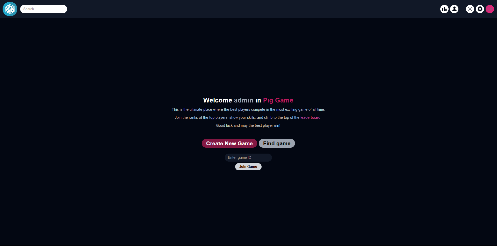

# Pig Game

Full stack realtime Pig Game with chat built using the MERN stack that allows you to play with friends

## Contents

- [App Preview](#app-preview)
- [Overview](#overview)
  - [Features](#features)
  - [Technologies Used](#technologies-used)
- [Run Locally](#get-repository)

### App Preview




## Overview

### Features

- Authentication: Login and registration
- User Profile: View user profile
- Game Management: Create a new game or join an existing game
- User Search: Search for other users in the application
- User Settings: Manage your account settings
- Leaderboard: View the top players in the game
- Admin: Manage user roles and enforce player bans

### Technologies Used


## Get repository

Clone the project

```bash
  git clone https://github.com/lucasfsn/pig-game
```

Go to the project directory

```bash
  cd pig-game
```

#### The client and server installation steps can be found in their directories

## Author

- GitHub - [@lucasfsn](https://github.com/lucasfsn)
